# CamVox

## A Low-cost and Accurate Lidar-assisted Visual SLAM System

Point cloud density of  **Livox lidar Horizon**  as a function of integration time, the pattern does not repeat itself.

<div align=center>
	
</div>

We propose **CamVox** by adapting Livox lidars into visual SLAM (ORB-SLAM2) by exploring the lidars’ unique features. Based on the non-repeating nature of Livox lidars, we propose an automatic lidar-camera calibration method that will work in uncontrolled scenes. 

<div align=center>
	
</div>

The long depth detection range also benefit a more efficient mapping. Comparison of CamVox with visual SLAM (VINS-mono) and lidar SLAM (livox_horizon_loam) are evaluated on the same dataset to demonstrate the performance.

<div align="center">
    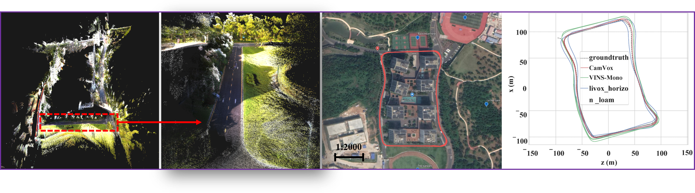
</div>

**Developer:**  [Yuewen Zhu](https://github.com/zywok), [Chunran Zheng](https://github.com/xuankuzcr), [Chongjian Yuan](https://github.com/ChongjianYUAN), [Xu Huang](https://github.com/Xxxxhx).

**Our related video**: our related videos are now available on [[YouTube Video](https://www.youtube.com/watch?v=AUnZNBB-uUE)] [[bilibili Video](https://www.bilibili.com/video/BV1fZ4y1V795/)] [[OwnCloud](http://www.zywok.com:20441/index.php/s/de8ESepxDJFAOOK)] 

**Paper:** our related paper has been posted on [arXiv](https://arxiv.org/abs/2011.11357), and final ICRA2021 accepted version can be available [CamVox.pdf](http://www.zywok.com:20441/index.php/s/xEqCafR6dEp4REZ).

**Lidar-Camera Automatic calibration follow-up work:**  ["Pixel-level Extrinsic Self Calibration of High Resolution LiDAR and Camera in Targetless Environments"](https://github.com/hku-mars/livox_camera_calib).


## 1. Prerequisites
### 1.1 Ubuntu and ROS
Ubuntu 64-bit 16.04 or 18.04.
ROS Kinetic or Melodic. Follow [ROS Installation](http://wiki.ros.org/ROS/Installation).    
(**Recommended version Ubunutu 16.04 LTS  kernel version 4.15.0-140-generic**)

### 1.2 OpenCV
We use OpenCV to manipulate images and features. Follow [Opencv Installation](http://opencv.org). Required at leat 2.4.3. Tested with OpenCV 2.4.11 and OpenCV 3.4.1. 

```bash
   (1)  *** Install dependencies: ***
	sudo apt-get install build-essential libgtk2.0-dev libavcodec-dev libavformat-dev  libjpeg.dev libtiff4.dev  libswscale-dev libjasper-dev   
   (2)  *** Install opencv-3.4.1: ***
   	cd opencv-3.4.1
	mkdir build && cd build
	cmake -D CMAKE_BUILD_TYPE=Release -D CMAKE_INSTALL_PREFIX=/usr/local ..
	make -j
	sudo make install
   (4)  *** Add opencv libraries to path: ***
	sudo gedit /etc/ld.so.conf.d/opencv.conf 
        *** add in the file's end: ***
	/usr/local/lib 
	sudo ldconfig
   (5)  *** bash configurtion: ***
	sudo gedit /etc/bash.bashrc  
	*** add in the end: ***
	PKG_CONFIG_PATH=$PKG_CONFIG_PATH:/usr/local/lib/pkgconfig  
	export PKG_CONFIG_PATH  
	source configurtion:
	source /etc/bash.bashrc  
	sudo updatedb
```

(**Recommended version [OpenCV-3.4.1.zip](http://www.zywok.com:20441/index.php/s/vj8cP3QZAUqK0Gg)**)

### 1.3 PCL-1.7
We use PCL to deal with point cloud features and Lidar-camera extrinsic parameters calibration. PCL Installation version recommended as follows.

```bash
   (1)  *** update your host: ***
   	sudo apt-get update
   (2)  *** install VTK ***
        cd VTK-8.2.0
        mkdir build && cd build
        cmake ..
        make -j
        sudo make install
   (3)  *** install pcl: ***
        sudo apt-get install libpcl-dev pcl-tools
        sudo apt-get install freeglut3-dev
```

(**Recommended VTK version [VTK-8.2.0.tar.gz](http://www.zywok.com:20441/index.php/s/lsILwir9tvbFWw5)**)

### 1.4  Pangolin
We use [Pangolin](https://github.com/stevenlovegrove/Pangolin) for visualization and user interface. Follow [Pangolin Installation](https://github.com/stevenlovegrove/Pangolin). 

```bash
   (1)  *** install dependencies: ***
   	sudo apt-get install libglew-dev libpython2.7-dev libboost-dev libboost-thread-dev libboost-filesystem-dev -y
   (3)  *** install Pangolin: ***
        cd Pangolin
        mkdir build && cd build
        cmake ..
        make -j
        sudo make install
```

(**Recommended version [Pangolin.zip](http://www.zywok.com:20441/index.php/s/hqgpWLazZdAFk8l)**)

### 1.5 Ceres Solver
Follow [Ceres Installation](http://ceres-solver.org/installation.html).

```bash
   (1)  *** install dependencies: ***
        sudo apt-get install liblapack-dev 
        sudo apt-get install libsuitesparse-dev 
        sudo apt-get install libcxsparse3.1.4 
        sudo apt-get install libgflags-dev 
        sudo apt-get install libgoogle-glog-dev libgtest-dev
   (2)  *** install ceres: ***
        cd ceres-solver-1.14.0
        mkdir build && cd build
        cmake ..
        make -j 
        sudo make install
```

(**Recommended version [Ceres-solver-1.14.0.tar.gz](http://www.zywok.com:20441/index.php/s/sglAQURmV4CjYF4)**)

### 1.6  Eigen
Follow [Eigen Installation](http://eigen.tuxfamily.org). Required at least 3.1.0.  

```bash
   (1)  *** install eigen: ***
        cd eigen
        mkdir build && cd build
        cmake ..
        make -j 
        sudo make install
```

(**Recommended version [Eigen-3.2.10.tar.gz](http://www.zywok.com:20441/index.php/s/TRc7mCNPQB7o5AD)**)

### 1.7  Livox-SDK
Follow [Livox-SDK  Installation](https://github.com/Livox-SDK/Livox-SDK).
(**Recommended version [Livox-SDK-master.zip](http://www.zywok.com:20441/index.php/s/sBMd7auN5Dxclnh)**)

### 1.8  MVS camera SDK and Ros driver
Install the [HIKROBOT](https://en.hikrobotics.com/) camera SDK as follows.

```bash
    tar zxvf MVS-2.0.0_x86_64_20191126.tar.gz
    cd ./MVS-2.0.0_x86_64_20191126
    chmod +x setup.sh
    sudo ./setup.sh
```
In addition, we supply a (**[software trigger Hikvisions' compatible Ros drivers](http://www.zywok.com:20441/index.php/s/4RSqFVvFwR5DYGg)**), you can run it directly just use USB to connect the camera.

```bash
    roslaunch mvs_camera mvs_camera.launch
```

(**Recommended version [MVS-2.0.0.tar.gz](http://www.zywok.com:20441/index.php/s/4YL9F3eJkgWjQ2J)**)

## 2. Build CamVox
Clone the repository and catkin_make:

```bash
    cd ~/catkin_ws/src
    git clone https://github.com/ISEE-Technology/CamVox.git
    cd CamVox/isee-camvox && chmod a+x build.sh && chmod a+x build_ros.sh
    ./build.sh
    ./build_ros.sh
    source ~/catkin_ws/devel/setup.bash
    
    cd CamVox/isee-camvox/Vocabulary
    tar zxvf ORBvoc.txt.tar.gz
```
## 3. Run with Hardware
### 3.1 Hardware

 <table>
	<tr>
	    <th>Platform</th>
	    <th>Item</th>
	    <th>Pics</th>  
	    <th>Shopping Link</th> 
	</tr >
	<tr >
	    <td rowspan="5">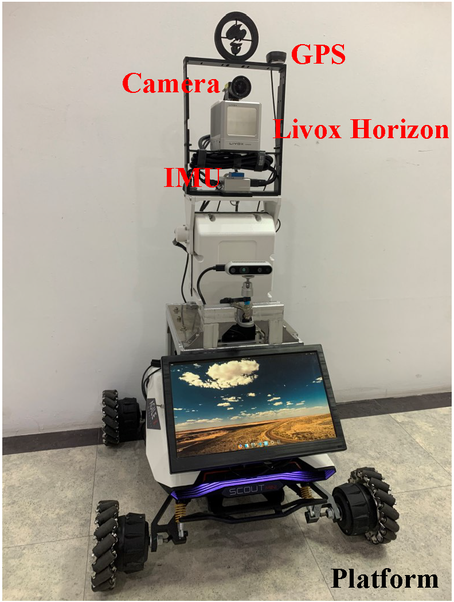</td>
	    <td>Livox Horizon </td>
	    <td align="center" valign="middle">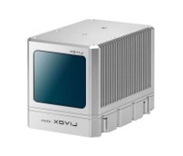</td>
            <td align="center" valign="middle">  <a href ="https://www.livoxtech.com/horizon"> Lidar </a> </td>
	</tr>
	<tr>
	    <td> MV-CE060-10UC</td>
	    <td align="center" valign="middle">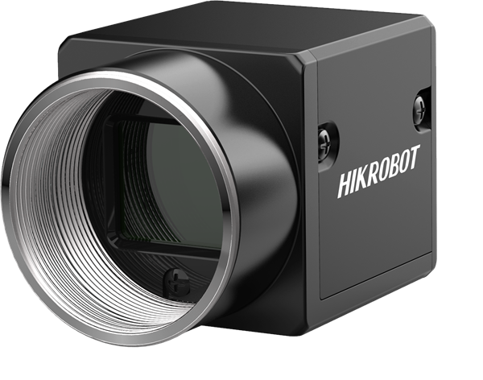</td>
	    <td align="center" valign="middle">  <a href ="https://en.hikrobotics.com/vision/visioninfo.htm?type=42&oid=2451"> Camera </a> </td>
	</tr>
	<tr>
	    <td> Inertial Sense uINS </td>
	    <td align="center" valign="middle"> 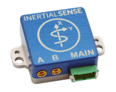 </td>
	    <td align="center" valign="middle"> <a href ="https://inertialsense.com/product/rugged-µins/"> RTK </a> </td>
	</tr>
	<tr>
	    <td>Manifold2C</td>
	    <td align="center" valign="middle">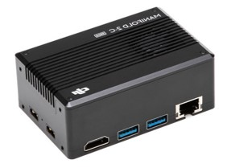</td>
            <td align="center" valign="middle">  <a href ="https://www.dji.com/cn/manifold-2"> Onboard-Computer </a> </td>
	</tr>
	<tr>
	    <td> Scout-mini </td>
	    <td align="center" valign="middle"></td>
	    <td align="center" valign="middle">  <a href ="http://www.agilex.ai/index/product/id/3?lang=zh-cn"> Robot Chassis </a> </td>
	</tr>
</table>

### 3.2 Hard Synchronization

Hard synchronization is performed with all of these sensors by a trigger signal of 10 Hz. The camera output at each trigger signal(10 Hz). The lidar keeps a clock (synced with GPS-RTK) and continuously outputs the scanned point with an accurate timestamp. In the meantime, the IMU outputs at a frequency of 200 Hz synced with the trigger. The Hardware Synchronization diagram is as follows.

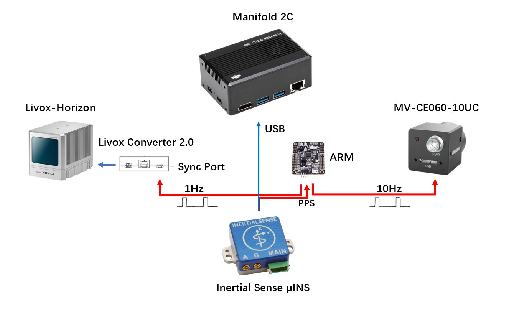

### 3.3 Running

Connect to your PC to Livox Horizon lidar by following  [Livox-ros-driver installation](https://github.com/Livox-SDK/livox_ros_driver).

```bash
    cd ~/catkin_ws/src/CamVox/
    chmod +x run.sh
    ./run.sh
```


## 4. Run with Rosbag Example

### 4.1 SUSTech Expert Flat Outdoor large scale scenes  (With Loop Closure)

<div align=center>
	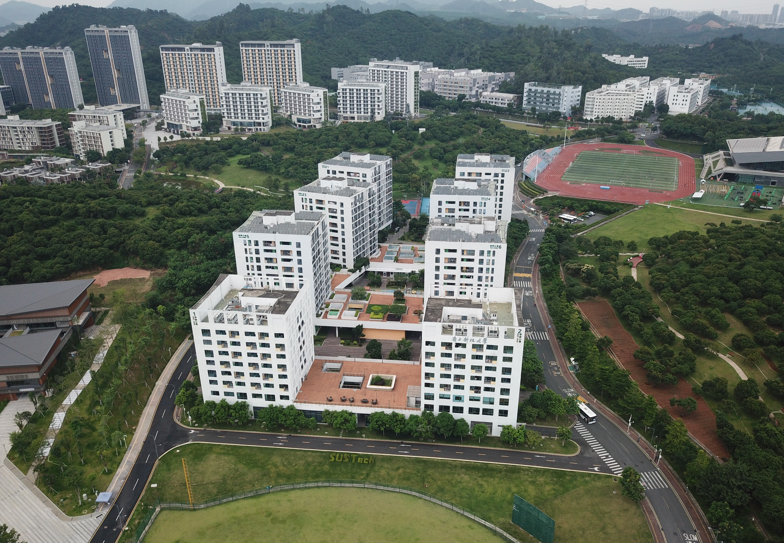
</div>

We open sourced our dataset in SUSTech campus with loop closure. [CamVox.bag](http://www.zywok.com:20441/index.php/s/bj55H4bgYh2bqSF).  (**Updated**)

Other two main framework data formats  for comparison. [VINS-mono.bag](http://www.zywok.com:20441/index.php/s/c3vmOIpaSMjKbD7) | [livox_loam_horizon.bag](http://www.zywok.com:20441/index.php/s/sNZdxe1e9NWzXRt) |  [Groundtruth.rar](http://www.zywok.com:20441/index.php/s/FSp72M9AkXwEP5s)  (**Updated**)

<div align=center>
	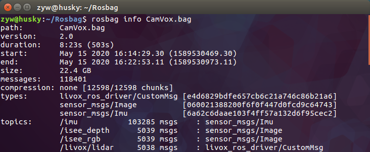
	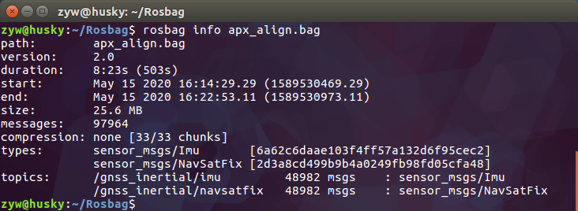
</div>
The comparisons of the trajectories from CamVox, two mainstream SLAM framework and the ground truth are evaluated on our SUSTech dataset as shown in above figure .


### 4.2 Rosbag Example with static scenes (Automatic Calibration trigger)

<div align=center>
	
</div>

We provide a rosbag file with static scenes to test the automatic calibration thread. [calibration.bag](http://www.zywok.com:20441/index.php/s/JcILwT3RidRV5Cw).  (**Updated**)
When the car detects more than **10 frames of still images (about 1 second)**, the automatic calibration thread starts to work. The thread will be interrupted to enter the SLAM mode if the car starts to move before the end of calibration. 
The effects of automatic calibration is shown as follows.

<div align=center>
	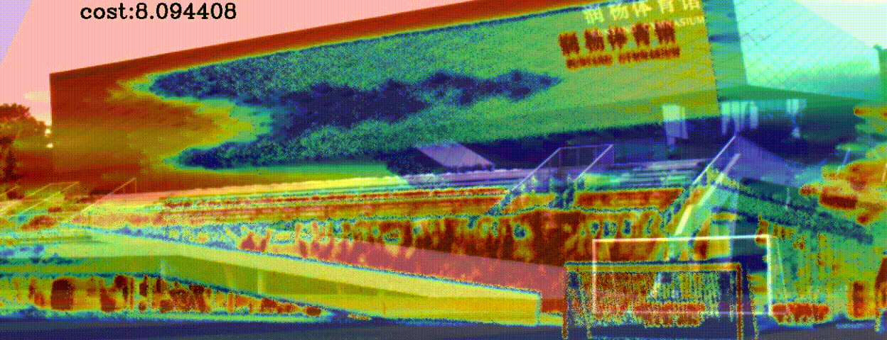
    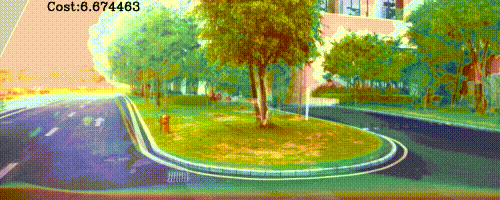
</div>

An example of RGB camera and point cloud overlay after calibration. (a) not calibrated. (b) automatically calibrated. (c) the best manual calibration. The automatic calibration algorithms is verified at various scenes, (d) outdoor road with natural trees and grasses, (e) outdoor artificial structures, (f) indoor underexposed structures. (g-i) represent the cost value evolution in the optimization process corresponding to the scenes on the left.

<div align=center>
	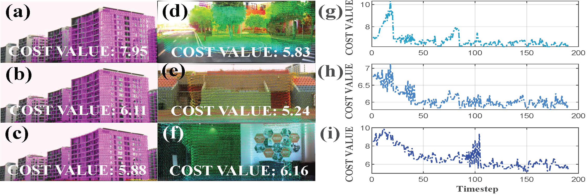
</div>

### 4.3 Running Rosbag Examples
#### 4.3.1  running without saving trajectory and colored pcd files
```bash
    roscore
    cd CamVox/isee-camvox
    rosrun online camvox Vocabulary/ORBvoc.bin camvox/online/Livox.yaml 
    rosbag play CamVox.bag (or calibration.bag)
```
#### 4.3.2  saving trajectory and colored  pcd files after finishing specified frames (e.g. 1000)
```bash
    roscore
    cd CamVox/isee-camvox
    rosrun online camvox Vocabulary/ORBvoc.bin camvox/online/Livox.yaml 1000
    rosbag play CamVox.bag (or calibration.bag)
```

## 5. Acknowledgements
The authors are grateful for the pioneering work from [ORB_SLAM2](https://github.com/raulmur/ORB_SLAM2), [ORB-SLAM2: an Open-Source SLAM System for Monocular, Stereo and RGB-D Cameras](https://ieeexplore.ieee.org/document/7946260). The authors also sincerely thank colleagues at Livox Technology for help in data aquisition and discussion. 
This work is from [ISEE Research Group](https://isee.technology/) at SUSTech.

## 6. License

The source code is released under [GPLv2.0](http://www.gnu.org/licenses/) license. 

If you use CamVox in an academic work, please cite:

    (**Updated**)  @misc{zhu2020camvox,
      title={CamVox: A Low-cost and Accurate Lidar-assisted Visual SLAM System}, 
      author={Yuewen Zhu and Chunran Zheng and Chongjian Yuan and Xu Huang and Xiaoping Hong},
      year={2020},
      eprint={2011.11357},
      archivePrefix={arXiv},
      primaryClass={cs.RO}
      }
